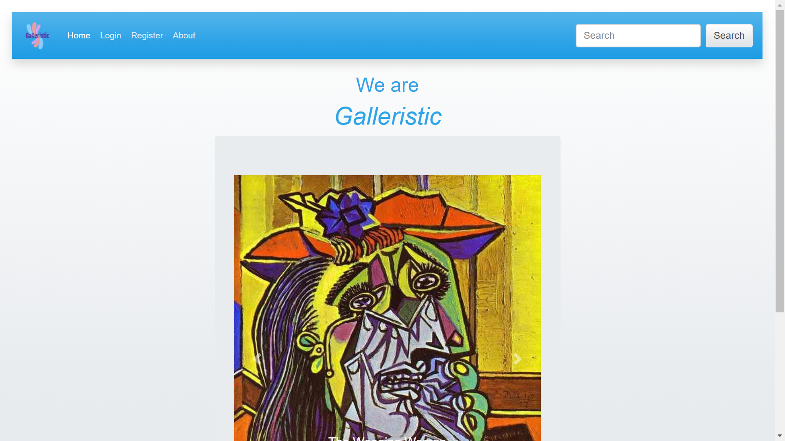
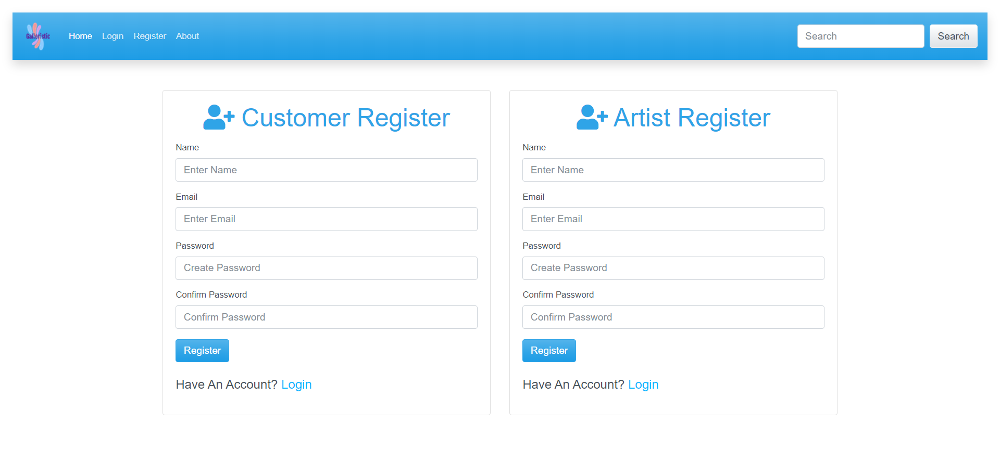
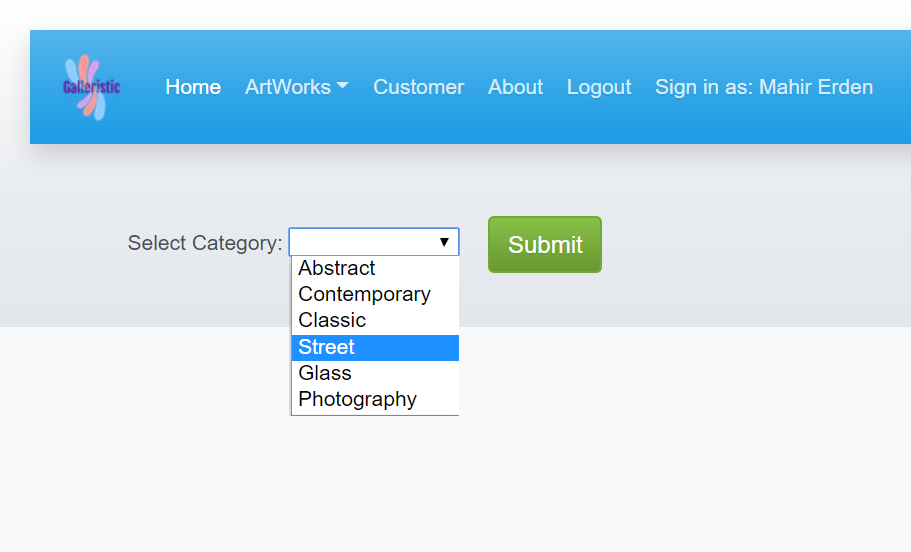
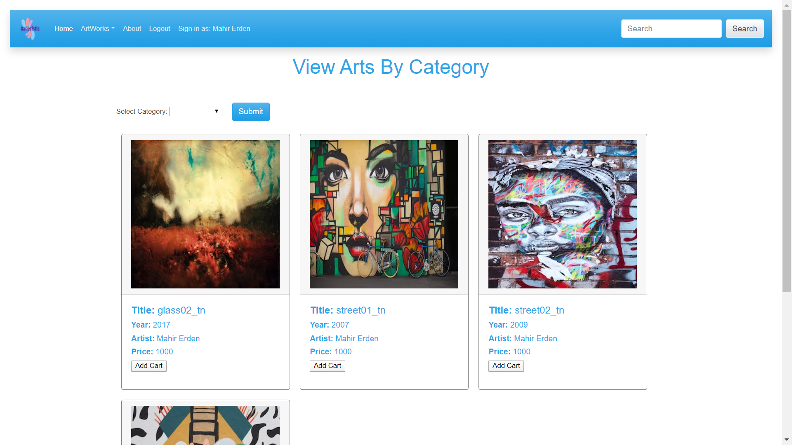
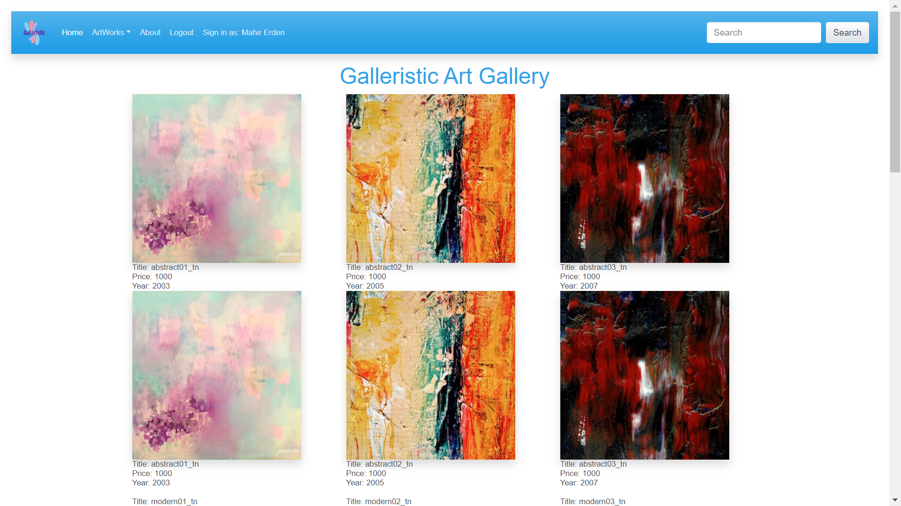
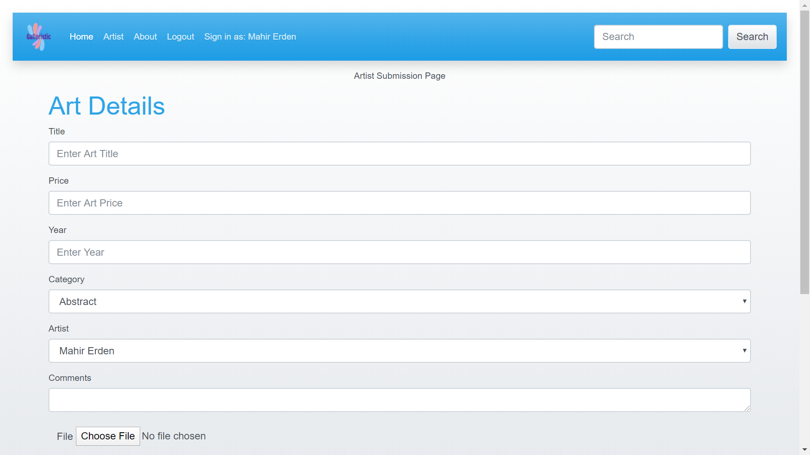

# Galleristic

## Project 2

This is a Node and Express server application where artists and art lovers meet. 

Heroku hosting path is as below:
https://morning-hollows-80184.herokuapp.com/

Application can be invoked with the following code
```sh
npm start
```
#### How application designed:
* Node and express server used
* Application backed by Mysql and Sequelize
* Get and Post routes used for retrieving and adding new data
* Application deployed using Heroku and Jawsdb
* CSS framework and Bootstrap used for styling
* Followed MVC paradigm
* Used Handlebars as frontend
* Used additional npm packages : express-session, passport, multer, helmet, bcryptjs, mysql2 and cookie-parser

#### Frontend Design:



Customer and Artists can login seperately. 
application menu items are shown or hidden according to user type


Customer and Artists can be registered seperately.


Customer can filter artworks by category or artists




Customer can see recorded artworks


Artists can define and upload their artworks with the following page


#### Backend Design:
##### Database Name: Galleristic

###### Artist Table
```sh
var Artist = sequelize.define("Artist", {
    name: {
      type: DataTypes.STRING,
      allowNull: false,
      validate: {
        len: [1]
      }
    },
    email: {
      type: DataTypes.STRING,
      allowNull: false,
      unique: true,
      validate: {
        isEmail: true
      }
    },
    password: {
      type: DataTypes.STRING,
      allowNull: false,
      validate: {
        len: [1]
      }
    }
  });

  Artist.associate = function(models) {
    // Associating Artist with Arts
    // When an Artist is deleted, also delete any associated Arts
    Artist.hasMany(models.Arts, {
      onDelete: "cascade"
    });
  };
```
###### Arts Table
```sh
  var Arts = sequelize.define("Arts", {
    title: {
      type: DataTypes.STRING,
      validate: {
        len: [1]
      }
    },
    price: {
      type: DataTypes.INTEGER,
      validate: {
        len: [1]
      }
    },
    year: {
      type: DataTypes.INTEGER,
      validate: {
        len: [1]
      }
    },
    file: {
      type: DataTypes.TEXT,
      len: [1]
    },
  comment: {
  type: DataTypes.TEXT,
  len: [1]
  }
  });

  // Associate with Artist
  Arts.associate = function(models) {
    // We're saying that a Arts should belong to an Artist
    // An Art can't be created without an Artist due to the foreign key constraint
    Arts.belongsTo(models.Artist, {
      foreignKey: {
        allowNull: true
      }
    });
    
    Arts.belongsTo(models.Category, {
      foreignKey: {
        allowNull: true
      }
    });

    Arts.belongsTo(models.Customer, {
      foreignKey: {
        allowNull: true
      }
    });
  };
```
###### Category Table
```sh
  var Category = sequelize.define("Category", {
    name: {
      type: DataTypes.STRING,
      allowNull: false,
      validate: {
        len: [1]
      }
    }
  });

Category.associate = function(models) {
  // Associating Category with Arts
  // When an Category is deleted, also delete any associated Arts
  Category.hasMany(models.Arts);
};
```
###### Customer Table
```sh
var Customer = sequelize.define("Customer", {
    name: {
      type: DataTypes.STRING,
      allowNull: false,
      validate: {
        len: [1]
      }
    },
    email: {
      type: DataTypes.STRING,
      allowNull: false,
      unique: true,
      validate: {
        isEmail: true
      }
    },
    password: {
      type: DataTypes.STRING,
      allowNull: false,
      len: [1]
    }
  });

Customer.associate = function(models) {
  // Associating Customer with Arts
  // When an Customer is deleted, also delete any associated Arts
  Customer.hasMany(models.Arts);
};
```
